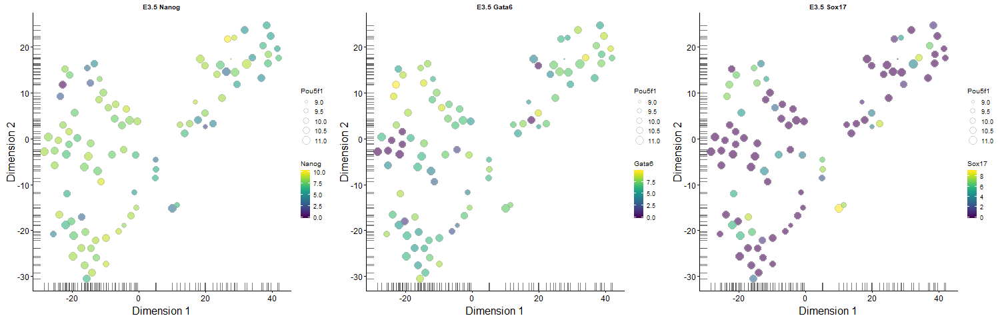
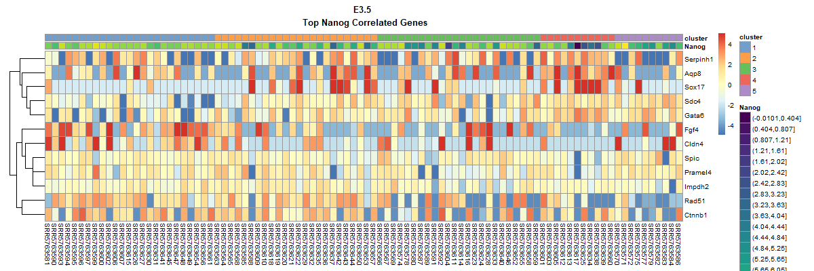

# MScProject
MSc Bioinformatics Final Project

---
title: Laboratory Report - Investigating the role of Nanog during peri-implatation
  of mouse embryo using scRNA-seq expression analysis
author: "Salvatore Ivan Puglisi (B125042)"
date: "21/05/2018 - 31/07/2018"
output: html_notebook
bibliography: biblio.bib
---

# Background

The pluripotent state of mouse embryonic stem cells (ESCs) is commonly associated with high levels of certain transcription factors such as Nanog, Sox2 and Oct4, which are important for establishing and maintaining the pluripotent state.  The influence of specific ratios of Oct4 and Nanog in individual ESCs on the pluripotency establishment, has already been observed in-vitro [@munoz_descalzo_silvia_correlations_2012], suggesting the possibility of using the distribution of this ratio as a quantifiers to distinguish between three subpopulations in a ESCs culture: pluripotent, lineage-primed and differentiating cells.
Nanog is a divergent homeodomain protein found in mammalian pluripotent cells [@chambers_functional_2003], its presence is considered and hallmark of pluripotent cells in vivo and in-vitro, and its loss an early marker of differentiation [@chambers_nanog_2007]. Nanog is a core element of the pluripotency gene regulatory network (GRN) [@boyer_core_2005] and previous studies [@ptashne_transcription_2001] suggests a combinatorial control of transcription factors  to taking place in proximity of their target genes. What is still unclear is the magnitude of influence upon the GRN targets delivered by the expression variation of a single factor. 
A culture of mouse ESCs consists in a mixture of cells with different levels of Nanog expression, because individual mouse ESCs express different levels of Nanog. Individual Nanog low cells, if grown in culture, can reproduce the whole population of cells expressing different levels of Nanog. 
ESCs expressing Nanog at lower levels are more likely to differentiate than cells expressing high Nanog levels and so the Nanog low state may be considered a marker of early stage in differentiation.  
ESCs knockout for Nanog gene can be produced and maintained in culture. By inducing the expression of a Nanog transgene is possible to revert back the Nanog expression of the WT ESCs.
The inability of Nanog -/-cells to complete transcription-factor-based reprogramming mirrors the phenotype observed in Nanog null embryos, providing a model to study the unique role of Nanog during the acquisition of pluripotency in early development.

In a previous study [@festuccia_esrrb_2012] the effects of altering the expression of Nanog has been analyzed, generating in-vitro ESCs knockout for Nanog. This ESCs Nanog -/- model could provide a way to study the unique role of Nanog during the acquisition of pluripotency in early development. More than 5,000 genes were confirmed to bind Nanog using ChIP-seq experiments, but only a small subset of 64 genes showed a > 1.5 fold change in increasing or decreasing expression, after reinduction of Nanog activity in the ESCs Nanog -/-. Among this 64 Nanog identified target genes, ESRRB shows the strongest transcriptional induction and has been proven to substitute for Nanog function in pluripotent cells. Furthermore, the findings that ESRRB is a direct target of Nanog, together with the notion that ESRRB can positively regulate Nanog, demonstrate the existence of a positive feedback mechanism [@oliveri_global_2008].
Similar observations suggest that the presence of Nanog is necessary but not sufficient to alter the transcriptional rates of it's target genes and confirm the needing of multiple additional pluripotency transcription factors to bind the same targets. Apparently some pluripotency factors like Oct4 are essential to maintain the pluripotent state (Oct4 depletion leads to differentiation [@hall_oct4_2009])  while fluctuations in Nanog (and consequently ESRRB) confer flexibility to the GRN, tuning the expression of downstream genes and leading to cell fate decisions [@chambers_nanog_2007].
The pre-implantation mouse embryo at day E3.5 consists of an inner cell mass (ICM) not possessing distinct lineage identities. Networks of genes including several known pluripotency markers are observed exclusively at this stage. Implantation occurs at approximately embryonic day E4.5 and marks several key changes in the embryo. The embryonic epiblast is formed, combined with two extra-embryonic layers: the trophectoderm and primitive endoderm (PrE). the pluripotent epiblast dynamically changes post-implantation, developing into a transcriptionally distinct entity primed for differentiation [@mohammed_single-cell_2017].
ESCs are derived from the embryos at stage E3.5 of differentiation and might be expected to show similar expression profile for Nanog. Embryonic cells at stage E4.5 still express Nanog but at a lower average level.
Nanog expression is indeed able to affects the ability of cells to differentiate in-vitro but is unknown how the same genes responding to Nanog observed in-vitro, correlate with Nanog in the embryo at stages E3.5 and E4.5 of differentiation.
In this study the following question will be addressed, using single cell RNA expression data. 

- Is it possible to clarify how the 64 genes responding to Nanog identified using the ESCs Nanog -/- model [@festuccia_esrrb_2012] behave in the embryo?  
- Are these genes unregulated or regulated in the same way observed in the ESCs in-vitro models? 
- Is it possible to measure how the Nanog expression is distributed across individual cells? Does it fluctuates naturally as expected in the real mouse embryo?

Performing a correlation analysis between the Nanog expression profile and the correspondent fluctuation of its target genes in the mouse embryo, will be possible to compare the behaviour of these gene between the ESCs,  pre-implantation (E3.5)  and post-implantation cells (E4.5).

# Purpose

The aim of this study is to investigate if the Nanog target genes proven to bind and respond to Nanog in the ESCs in-vitro model, are correlated with Nanog expression fluctuation in single mESC cells profiled using single cell RNA-seq (scRNA-seq).  We would then like to know how these genes are correlated to Nanog expression  during two stages of the early mouse embryo development: the pre-implantation inner cell mass at E3.5 and the post-implantation epiblast at E4.5.

# Analysis 

An outline of the analytic methods used during my intership is reported below.
More detailed R scripts and higher resolution output graphics can be found into the "analysis" folder, inside the specific subdirectories "all", "e35", "e45".
It is also possible to load the R Workspace Files and run the script inside the R markdown notebook changing some parameters.

## Dataset Description

The data analyzed in this project are originated from 

> Mohammed, H., Hernando-Herraez, I., Savino, A., Scialdone, A., Macaulay, I., Mulas, C., Chandra, T., Voet, T., Dean, W., Nichols, J., et al. (2017). Single-Cell Landscape of Transcriptional Heterogeneity and Cell Fate Decisions during Mouse Early Gastrulation. Cell Rep. 20, 1215-1228.

The authors isolated Single cells from C57Bl/6Babr Mus musculus embryos at E3.5, E4.5, E5.5 and E6.5 stages, subjecting them to single-cell RNA-seq protocol, using the platform Illumina HiSeq 2500 (generating 100 bp paired-end reads).

The references for the online repositories are reported below:

BioProject ID: [PRJNA392258](https://www.ncbi.nlm.nih.gov/bioproject/PRJNA392258) 

GEO ID: [GSE100597](https://www.ncbi.nlm.nih.gov/geo/query/acc.cgi?acc=GSE100597)

SRA ID: [SRP110669](https://trace.ncbi.nlm.nih.gov/Traces/sra/sra.cgi?study=SRP110669)


Only E3.5 & E4.5 are considered in this study, to explore lineage and regulatory processes involved in early peri-implantation mouse embryos.

Total SRA Experiments: 
721 samples (SRR5763563 - SRR5764283)

E3.5 subset: 
99 samples (SRR5763563 - SRR5763661)

E4.5 subset: 
105 samples (SRR5763662 - SRR5763766)


*Fig. 1 - Example summary generated by FastQC for one sample.*


## Quality control & preprocessing of reads

The analysis has been carried out via SSH on the following server 

> bioinfmsc3.mvm.ed.ac.uk"

The UNIX environment has been prepared, upgrading R to the release 3.5.0 as a requirement for installing the ["scater"] [@mccarthy_scater:_2017] and other [Bioconductor] [@huber_orchestrating_2015] packages [@lun_scran_2018], [@ritchie_limma_2015].

```
source("https://bioconductor.org/biocLite.R")
biocLite(c("scater","scran","limma"))
```

Other command-line tools required for the data preprocessing and the genomic allignment have been installed via [Bioconda](https://bioconda.github.io/) [@gruning_bioconda:_2018].

```
wget https://repo.anaconda.com/archive/Anaconda3-5.2.0-Linux-x86_64.sh
sh Anaconda3-5.2.0-Linux-x86_64.sh # added Anaconda/bin to PATH
conda install -c bioconda sra-tools fastqc multiqc trim-galore kallisto
```
[SRA Toolkit](https://www.ncbi.nlm.nih.gov/books/NBK158900/) is a collection of tools and libraries for using data in the INSDC Sequence Read Archives.
[FastQC](https://www.bioinformatics.babraham.ac.uk/projects/fastqc/) [@andrews_fastqc_2018] and [MultiQC](http://multiqc.info/) [@ewels_multiqc:_2016] are the quality control tools which have been used to assess the overall quality of the reads.
[Trim Galore!](https://www.bioinformatics.babraham.ac.uk/projects/trim_galore/) [@krueger_trim_2018] is a wrapper of cutadapt and Fastqc, used to filter-out the low quality reads and trimming the adapter contamination detected during the quality control.
[kallisto](https://pachterlab.github.io/kallisto/) [@bray_near-optimal_2016] is a pseudoalignment program for rapidly determining the compatibility of high-throughput sequencing reads with targets sequences, without the need for alignment. It has been used for quantifying abundances of transcripts in the Mus musculus transcriptome from the scRNA-Seq data.

The main "project" folder has been created on my home directory, with the following subfolders:

- data -> containing the fastq files downloaded and processed from the SRA repositories
- references -> containing the M. musculus transcriptome and annotation files dowloaded from ENSEMBL repositories
- indices -> containing the index file generated by kallisto, to be used for the preudoalignment
- results -> containing the abundances files generated by kallisto quant
- analysis -> containing the RData files and the output of the Bioconductor analysis

The experiment "SRP110669" has been downloaded from SRA repository inside the "data" folder and the sample files converted to compressed FastQ files by the fastq-dump utility (part of SRA Toolkit).

```
wget -r -N -nd ftp://ftp-trace.ncbi.nih.gov/sra/sra-instant/reads/ByStudy/sra/SRP/SRP110/SRP110669/

# using the option --split-files forward and reverse reads in every SRA file are separated in 2 Fastq files

fastq-dump --split-files --gzip --sra-id *.sra

# Run FastQC for all samples

$ fastqc *.fastq.gz
```

Looking at the HTML reports generated by FastQC the quality appears to be on average over 25 phred score along the lenght of each read.


*Fig. 2 - MultiQC Sequence Quality Histograms. The mean quality value across each base position in the read for all samples. *


Anyway it is possible to observe that 5' end of the reads in any sample is affected by base content similarity, due to use of random k-mers (which are not so random) or transposases (nextera transposases, causing tagmentation) in library preparation.


*Fig. 3 - Per Base Sequence Content Plot from FastQC for one sample, showing the relative amount of each base at each position.*


The first run of FASTQC detected adapter contamination by nextera transposase.


 
*Fig. 4 - FastQC Adapter Content plot, showing a cumulative percentage count of the proportion of library which has seen each of the adapter sequences at each position* 

 
The non-random per base sequence content caused by random k-mers cannot be corrected but should not affect the analysis.
The removal of the adapter contamination is possible.

Using Trim Galore! has been performed a quality trimming/filtering (phred score >20) and sequence trimming (for nextera trasposase).

First I prepared a tab-separated list of the fastq paired files

> fastq_gz_trim_list.txt

```
SRR5763563_1.fastq.gz	SRR5763563_2.fastq.gz
SRR5763564_1.fastq.gz	SRR5763564_2.fastq.gz
SRR5763565_1.fastq.gz	SRR5763565_2.fastq.gz
SRR5763566_1.fastq.gz	SRR5763566_2.fastq.gz
...............      ................
```
and script to create a parallel job list that runs trim-galore!

> Make_job_list_trim.sh

```
#!/bin/bash

[ $# -ne 2 ] && { echo -en "\n*** This script generates jobs for GNU parallel. *** \n\n Error Nothing to do, usage: < input tab delimited list > < output run list file >\n\n" ; exit 1; }
set -o pipefail

# Get command-line args
INPUT_LIST=$1
OUTPUT=$2

# Set counter
COUNT=1
END=$(wc -l $INPUT_LIST | awk '{print $1}')

echo " "
echo " * Input file is: $INPUT_LIST"
echo " * Number of runs: $END"
echo " * Output job list for GNU parallel saved to: $OUTPUT"
echo " "

# Main bit of command-line for job

CMD="trim_galore --nextera --paired"

# In alternative, to generate also BAM files
#CMD="kallisto quant -t 30 -b 30 --bias --pseudobam --genomebam --gtf ~/project/annotation/Mus_musculus.GRCm38.92.gtf --chromosomes ~/project/reference/chr_len.txt -i ~/project/indices/kallist$

# Main Loop
[ -e $OUTPUT ] && rm $OUTPUT
while [ $COUNT -le $END ];
do
    LINE=( $(awk "NR==$COUNT" $INPUT_LIST) )
    # Make file list
    echo "Working on $COUNT of $END, Files ${LINE[0]} ${LINE[1]}"
    echo "$CMD ${LINE[0]} ${LINE[1]} " >> $OUTPUT
    ((COUNT++))
done
```

```
# run script to create job list
sh Make_job_list_trim.sh fastq_gz_trim_list.txt trim_jobs_temp.txt

# converting carriage return into new line
tr '\r' '\n' < trim_jobs_temp.txt > trim_jobs.txt | rm trim_jobs_temp.txt

# run parallel on 8 threads (saving log)
parallel --progress --jobs 8 --joblog trim_joblog.txt < trim_jobs.txt

# rename generated trimmed files
rename "_val_1" "" *.fq.gz
rename "_val_2" "" *.fq.gz
PRE-TRIM vs POST-TRIM MultiQC Comparison
```


*Fig.5 - FastQC Adapter Content plot after adapter trimming and quality filtering.*


Nextera transposase residual sequences have been removed  removed but a slight heterogeneity in sequence length distribution has been generated across the samples.


*Fig. 6 - Sequence Length Distribution plot, showing the distribution of fragment sizes (read lengths) found.*


## Reads alignment to transcriptome (Kallisto)


Befor to perform the pseudo-alignment against the mouse transcriptome, kallisto requires to create an index from a FASTA formatted file of target sequences

M. musculus transcriptome (cDNA) has been dowloaded from the Ensembl FTP repository

```
wget ftp://ftp.ensembl.org/pub/release-92/fasta/mus_musculus/cdna/Mus_musculus.GRCm38.cdna.all.fa.gz /reference
```

Using this file a kallisto index has been generated with a default k-mer size of 31.

```
kallisto index  -i indices/kallisto/cdna.kidx reference/Mus_musculus.GRCm38.cdna.all.fa.gz 
```
```
[build] loading fasta file reference/transcripts/Mus_musculus.GRCm38.cdna.all.fa
[build] k-mer length: 31
[build] warning: clipped off poly-A tail (longer than 10) from 589 target sequences
[build] warning: replaced 3 non-ACGUT characters in the input sequence with pseudorandom nucleotides
[build] counting k-mers ... done.
[build] building target de Bruijn graph ...  done
[build] creating equivalence classes ...  done
[build] target de Bruijn graph has 691348 contigs and contains 97656136 k-mers
```

In order to produce the quantification, Kallisto has to be run for every paired-end sample, generating the "abundance" files to be imported in R and evaluate the differential expression.

kallisto can run on multiple instances using GNU parallel, in order to speed-up the process. 
To do so I prepared a tab-separated list of the samples

```
SRR5763563    SRR5763563_1.fq    SRR5763563_2.fq
SRR5763564    SRR5763564_1.fq    SRR5763564_2.fq
SRR5763565    SRR5763565_1.fq    SRR5763565_2.fq
SRR5763566    SRR5763566_1.fq    SRR5763566_2.fq
SRR5763567    SRR5763567_1.fq    SRR5763567_2.fq
.........	    ..........	        ...........

```

And a bash script to ingest this list and generate the jobs for parallel...


> Make_job_list_kallisto.sh

```
#!/bin/bash

[ $# -ne 2 ] && { echo -en "\n*** This script generates jobs for GNU parallel. *** \n\n Error Nothing to do, usage: < input tab delimited list > < output run list file >\n\n" ; exit 1; }
set -o pipefail

# Get command-line args
INPUT_LIST=$1
OUTPUT=$2

# Set counter
COUNT=1
END=$(wc -l $INPUT_LIST | awk '{print $1}')

echo " "
echo " * Input file is: $INPUT_LIST"
echo " * Number of runs: $END"
echo " * Output job list for GNU parallel saved to: $OUTPUT"
echo " "

# Main bit of command-line for job

CMD="kallisto quant -t 30 -b 30 --bias -i ~/project/indices/kallisto/cdna.kidx"

# In alternative, to generate also BAM files
#CMD="kallisto quant -t 30 -b 30 --bias --pseudobam --genomebam --gtf ~/project/annotation/Mus_musculus.GRCm38.92.gtf --chromosomes ~/project/reference/chr_len.txt -i ~/project/indices/kallisto/cdna.kidx"

# Main Loop
[ -e $OUTPUT ] && rm $OUTPUT
while [ $COUNT -le $END ];
do
    LINE=( $(awk "NR==$COUNT" $INPUT_LIST) )
    # Make file list
    echo "Working on $COUNT of $END Sample ID: ${LINE[0]}, Files ${LINE[1]} ${LINE[2]}"
    echo "$CMD -o ~/project/results/kallisto/${LINE[0]} ${LINE[1]} ${LINE[2]} " >> $OUTPUT
    ((COUNT++))
done
```

Other than index file and the FastQ files, additional options can be specified for Kallisto:
- --bias - learns parameters for a model of sequences specific bias and corrects the abundances accordlingly.
- --b - number of bootstrap for estimating the technical variance in samples (all bootstrap are compressed inside abundance.h5 output)
- --pseudobam - save pseudoalignments to transcriptome to BAM file
- --genomebam - Project pseudoalignments to genome sorted BAM file (used in combination with -g to specify the annotation GTF and -c to give a list of chromosome lenghts)

```
#Generating the job list
sh Make_job_list_kallisto.sh fastq_gz_kal_list.txt kallisto_jobs_temp.txt 

# converting carriage line to newline
tr '\r' '\n' < kallisto_jobs_temp.txt > kallisto_jobs.txt | rm kallisto_jobs_temp.txt

# running parallel for 8 threads (saving log)
nohup parallel --progress --jobs 8 --joblog kallisto_joblog.txt < kallisto_jobs.txt &
```

Outputs of kallisto are in folder "project/results/kallisto/".


## Bioconductor analysis

The same analysis pipeline has been performed for the abundance files referring to the stages E3.5 and E4.5
following the guidlines published here:

>Lun, A.T.L., McCarthy, D.J., and Marioni, J.C. (2016). A step-by-step workflow for low-level analysis of single-cell RNA-seq data. F1000Research 5, 2122.

All the R files and outputs are insite the "analysis" organized in subfolders depending on which samples the analysis has been performed:
- all -> contains the R output of the whole dataset analysis
- e35 -> contains the R output of the stage E3.5 analysis
- e45 -> contains the R output of the stage E4.5 analysis
- report -> contains the R output and the image files of this report

The exemple code used for the stage E4.5 is reported below.

*****

Set working directory

```{R}
setwd("~/project/analysis/e45")
```

### Data praparation

Loading required packages

```{R include=FALSE}
library(scater)
library(tximport)
library(scran)
library(limma)
```

Preparing E4.5 samples files

```{R}
metadata <- read.delim("samples_info.txt", check.names=FALSE, header=TRUE)
samples <- as.character(metadata$sample[metadata$stage == "E4.5"])
kal_dir <- "../../results/kallisto"
files <- file.path(kal_dir, samples, "abundance.h5")
```

Creating tx2gene to convert transcript_ids into gene_names in kallisto results

```{R include=FALSE}
library(EnsDb.Mmusculus.v79)
txdb <- EnsDb.Mmusculus.v79
keys <- keys(txdb, keytype = "TXNAME")
tx2gene <- select(txdb, keys, "GENEID", "TXNAME")
```

Creating singleCellExperiment from Kallisto results using Tximport, collapsing the rows by genes (txOut = FALSE)

```{R echo=TRUE}
sce <- readTxResults(samples = samples, files = files, type = "kallisto", tx2gene = tx2gene, ignoreTxVersion = TRUE, txOut = FALSE)
```

Query ensembldb using the Ensembl transcript ID (rownames) to retriver the annotation info to store into sce
By default BiomaRt uses the "mmusculus_gene_ensembl" dataset, retrieving "ensembl_transcript_id", "ensembl_gene_id", "mgi_symbol", "chromosome_name", "transcript_biotype", "transcript_start", "transcript_end"

```{R include=FALSE}
library(biomaRt)
sce <- getBMFeatureAnnos(sce, filters = "ensembl_gene_id")
```

Rename rownames with gene symbols

```{R}
rowData(sce)$ensembl_gene_id <- rownames(sce)
new.names <- rowData(sce)$mgi_symbol
missing.name <- is.na(new.names)
new.names[missing.name] <- rowData(sce)$ensembl_gene_id[missing.name]
dup.name <- new.names %in% new.names[duplicated(new.names)]
new.names[dup.name] <- paste0(new.names, "_", rowData(sce)$ensembl_gene_id)[dup.name]
rownames(sce) <- new.names

head(rownames(sce))
```

Define references for control_features to be used in calculateQCMetrics()

```{R}
mito <- which(rowData(sce)$chromosome_name=="MT")
```

Calculate cell metrics

```{r echo=TRUE}
sce <- calculateQCMetrics(sce, feature_controls=list(Mt=mito))

names(colData(sce))
```

### Cell-based QC

First let's have an overview of the features counts across the cells

```{R echo=TRUE, fig.height=10, fig.width=10}
par(mfrow=c(2,2))
hist(sce$total_counts/1e6, xlab="Library sizes (millions)", main="",
     breaks=20, col="grey80", ylab="Number of cells")
hist(sce$total_features, xlab="Number of expressed genes", main="",
     breaks=20, col="grey80", ylab="Number of cells")
plot(sce$total_features, sce$total_counts/1e6, xlab="Number of expressed genes", ylab="Library size (millions)")
plot(sce$total_features, sce$pct_counts_Mt, xlab="Number of expressed genes", ylab="Mitochondrial proportion (%)")
```
*Fig. 7 - Behaviour of each QC metric compared to the total number of expressed features. Each point represents a cell in the E4.5 dataset.*


Low-quality cells need to be removed to ensure that technical effects do not distort downstream analysis results. Two common measures of cell quality are the library size and the number of expressed features in each library. The library size is defined as the total sum of counts across all features. Cells with relatively small library sizes are considered to be of low quality as the RNA has not been efficiently captured (i.e., converted into cDNA and amplified) during library preparation. The number of expressed features in each cell is defined as the number of features with non-zero counts for that cell. Any cell with very few expressed genes is likely to be of poor quality as the diverse transcript population has not been successfully captured. 

### Identifying outliers for each metrics

Outliers are defined based on the median absolute deviation (MADs) from the median value of each metric across all cells. We remove cells with log-library sizes that are more than 3 MADs below the median log-library size & cells where the log-transformed number of expressed genes is 3 MADs below the median value. Another measure of quality is the proportion of reads mapped to genes in the mitochondrial genome. High proportions are indicative of poor-quality cells ([@ilicic_classification_2016], [@islam_quantitative_2014]), possibly because of increased apoptosis and/or loss of cytoplasmic RNA from lysed cells.

```{r echo=TRUE}
libsize.drop <- isOutlier(sce$total_counts, nmads=3, type="lower", log=TRUE)

feature.drop <- isOutlier(sce$total_features, nmads=3, type="lower", log=TRUE)

mito.drop <- isOutlier(sce$pct_counts_Mt, nmads=3, type="higher")
```

Subsetting by column will retain only the high-quality cells that pass each filter described. 
Let's see the number of cells removed by each filter as well as the total number of retained cells.

```{R echo=TRUE}
keep <- !(libsize.drop | feature.drop | mito.drop)
data.frame(ByLibSize=sum(libsize.drop), ByFeature=sum(feature.drop), ByMito=sum(mito.drop), Remaining=sum(keep))
```

Now subset the SingleCellExperiment object to retain only the putative high-quality cells. 

```{R}
sce <- sce[,!(libsize.drop | feature.drop | mito.drop)]
```

### Classification of cell-cycle phase

Using a method reported in literature [@scialdone_computational_2015] is possible to classify cells into cell cycle phases based on the gene expression data. Using a training dataset, the sign of the difference in expression between two genes was computed for each pair of genes. Pairs with changes in the sign across cell cycle phases were chosen as markers. Cells in a test dataset can then be classified into the appropriate phase, based on whether the observed sign for each marker pair is consistent with one phase or another.
The cyclone package contains a pre-trained set of marker pairs for mouse data, which can be loaded in the the readRDS function. We use the Ensembl identifiers for each gene in our dataset to match up with the names in the pre-trained set of gene pairs.

```{R echo=TRUE}
library(scran)
set.seed(100)
mm.pairs <- readRDS(system.file("exdata", "mouse_cycle_markers.rds", package="scran"))
assignments <- cyclone(sce, mm.pairs, gene.names=rowData(sce)$ensembl_gene_id)

plot(assignments$score$G1, assignments$score$G2M, xlab="G1 score", ylab="G2/M score", pch=16)
```
*Fig. 8 - Cell cycle phase scores from applying the pair-based classifier on the dataset. Each point represents a cell, plotted according to its scores for G1 and G2/M phases.*


How many cells have been predicted as dividing?

```{R echo=TRUE}
sce$phases <- assignments$phases
table(sce$phases)
```

Each cell is assigned a score for each phase, with a higher score corresponding to a higher probability that the cell is in that phase. We focus on the G1 and G2/M scores as these are the most informative for classification. Cells are classified as being in G1 phase if the G1 score is above 0.5 and greater than the G2/M score; in G2/M phase if the G2/M score is above 0.5 and greater than the G1 score; and in S phase if neither score is above 0.5. We can use the assigned phase as a blocking factor in downstream analyses. This protects against cell cycle effects without discarding information.

### Examining gene-level expression metrics

Inspecting the most highly expressed genes.
This should generally be dominated by constitutively expressed transcripts, such as those for ribosomal or mitochondrial proteins. The presence of other classes of features may be cause for concern if they are not consistent with expected biology. For example, the absence of ribosomal proteins and/or the presence of their pseudogenes are indicative of suboptimal alignment.

```{R echo=TRUE, fig.height=10, fig.width=8}
fontsize <- theme(axis.text=element_text(size=12), axis.title=element_text(size=16))

plotQC(sce, type = "highest-expression", n=50) + fontsize
```
*Fig. 9 - Percentage of total counts assigned to the top 50 most highly-abundant features in the dataset. For each feature, each bar represents the percentage assigned to that feature for a single cell, while the circle represents the average across all cells. Bars are coloured by the total number of expressed features in each cell, while circles are coloured according to whether the feature is labelled as a control feature.*


### Filtering out low-abundance genes

The average count for each gene, is computed across all cells in the dataset using the calcAverage() function, which also performs some adjustment for library size differences between cells. Typically can be observed a peak of moderately expressed genes following a plateau of lowly expressed genes.

```{R echo=TRUE}
ave.counts <- calcAverage(sce, use_size_factors=FALSE)

hist(log10(ave.counts), breaks=100, main="", col="grey80", xlab=expression(Log[10]~"average count"))
abline(v=log10(1), col="blue", lwd=2, lty=2)
```
*Fig. 10 - Histogram of log-average counts for all genes in the dataset. The filter threshold is represented by the blue line.*


All the genes with average counts less than 1 should be removed

```{R echo=TRUE}
demo.keep <- ave.counts >= 1
summary(demo.keep)
```

The number of TRUE values corresponds to the number of retained rows/genes after filtering.
Apply the threshold and create a filtered sce

```{R}
filtered.sce <- sce[demo.keep,]
```

### Examine number of cells that express each gene

Genes expressed in very few cells are often uninteresting as they are driven by amplification artifacts.

```{R echo=TRUE}
num.cells <- nexprs(sce, byrow=TRUE)

smoothScatter(log10(ave.counts), num.cells, ylab="Number of cells", xlab=expression(Log[10]~"average count"))
```
*Fig. 11 - The number of cells expressing each gene in the dataset, plotted against the log-average count. Intensity of colour corresponds to the number of genes at any given location.*


Genes that are not expressed in any cell are removed to reduce teh computational work in downstream steps

```{R echo=TRUE}
to.keep <- num.cells > 0
sce <- sce[to.keep,]
summary(to.keep)
```

### Normalization of cell-specific biases

Any systematic difference in count size across the non-DE majority of genes between two cells is assumed to represent bias and is removed by scaling. More specifically, "size factors" are calculated that represent the extent to which counts should be scaled in each library.
Single-cell data can be problematic for these bulk data-based methods due to the dominance of low and zero counts. To overcome this, counts are pooled from many cells to increase the count size for accurate size factor estimation. Pool-based size factors are then "deconvolved" into cell-based factors for cell-specific normalization.

```{R echo=TRUE}
# check how many samples remained
dim(sce)
```

```{R echo=TRUE}
# pooling groups of cells to calculate size factor
sce <- computeSumFactors(sce, sizes=c(10, 20, 30, 40, 50, 60, 70, 80, 94))
summary(sizeFactors(sce))
```

```{R echo=TRUE}
plot(sizeFactors(sce), sce$total_counts/1e6, log="xy",
     ylab="Library size (millions)", xlab="Size factor")
```
*Fig. 12 - Size factors from deconvolution, plotted against library sizes for all cells in the dataset. Axes are shown on a log-scale.*


Applying the size factors to normalize gene expression

```{R}
sce <- normalize(sce)
```

### Modelling the technical noise in gene expression

Testing for significantly positive biological components
(The biological component for each gene is defined as the difference between its total variance and the fitted value of the trend)
First, the biological and technical components of the gene-specific variance are computed...

```{R}
var.fit <- trendVar(sce, parametric=TRUE, loess.args=list(span=0.3), use.spikes=FALSE)
```

...then biological and technical variance are decomposed

```{R echo=TRUE}
var.out <- decomposeVar(sce, var.fit)

head(var.out)
```

We can visually inspect the trend

```{r echo=TRUE}
plot(var.out$mean, var.out$total, pch=16, cex=0.6, xlab="Mean log-expression", 
    ylab="Variance of log-expression", main="E4.5")
curve(var.fit$trend(x), col="dodgerblue", lwd=2, add=TRUE)
```
*Fig. 13 - Variance of normalized log-expression values for each gene in the dataset, plotted against the mean log-expression. The blue line represents the mean-dependent trend fitted to the variances.*


The wave-like shape is typical of the mean-variance trend for log-expression values. A linear increase in the variance is observed as the mean increases from zero, as larger variances are possible when the counts increase. At very high abundances, the effect of sampling noise decreases due to the law of large numbers, resulting in a decrease in the variance.

###  Visualizing data in low-dimensional space

Once the technical noise is modelled, principal components analysis can be used to remove random technical noise. Consider that each cell represents a point in the high-dimensional expression space, where the spread of points represents the total variance. PCA identifies axes in this space that capture as much of this variance as possible. Each axis is a principal component (PC), where any early PC will explain more of the variance than a later PC.

It is assumed that biological processes involving co-regulated groups of genes will account for the most variance in the data. If this is the case, this process should be represented by one or more of the earlier PCs. In contrast, random technical noise affects each gene independently and will be represented by later PCs. The denoisePCA() function removes later PCs until the total discarded variance is equal to the sum of technical components for all genes used in the PCA.

```{R echo=TRUE}
sce <- denoisePCA(sce, technical=var.out, assay.type="logcounts")
dim(reducedDim(sce, "PCA"))
```

The function returns a SingleCellExperiment object containing the PC scores for each cell in the reducedDims slot. The aim is to eliminate technical noise and enrich for biological signal in the retained PCs. This improves resolution of the underlying biology during downstream procedures such as clustering.

Now relationships between cells can be visualized by constructing pairwise PCA plots for the first three components

```{r}
plotReducedDim(sce, use_dimred="PCA", ncomponents=3) + fontsize
```
*Fig. 14 - Pairwise PCA plots of the first three PCs in the E4.5 dataset, constructed from normalized log-expression values of genes with positive biological components*


t-SNE (t-stochastic neighbour embedding) tends to work better than PCA for separating cells in more diverse populations. This is because the former can directly capture non-linear relationships in high-dimensional space, whereas the latter must represent them on linear axes.

use_dimred="PCA" can be set to perform the t-SNE on the low-rank approximation of the data, allowing the algorithm to take advantage of the previous denoising step.

```{r echo=TRUE, fig.height=4, fig.width=10}
set.seed(100)
out5 <- plotTSNE(sce, run_args=list(use_dimred="PCA", perplexity=5)) + fontsize + ggtitle("Perplexity = 5")

set.seed(100)
out10 <- plotTSNE(sce, run_args=list(use_dimred="PCA", perplexity=10)) + fontsize + ggtitle("Perplexity = 10")

set.seed(100)
out20 <- plotTSNE(sce, run_args=list(use_dimred="PCA", perplexity=20)) + fontsize + ggtitle("Perplexity = 20")

multiplot(out5, out10, out20, cols=3)
```
*Fig. 15 - t-SNE plots constructed from the denoised PCs in the E4.5 dataset, using a range of perplexity values.*


Scripts should set a seed to ensure that the chosen results are reproducible. It is also advisable to test different settings of the "perplexity" parameter as this will affect the distribution of points in the low-dimensional space.

Now run runTSNE() with a perplexity of 20 to store the t-SNE results inside our SingleCellExperiment object. This avoids repeating the calculations whenever we want to create a new plot with plotTSNE(), as the stored results will be used instead.

```{R echo=TRUE}
set.seed(100)
sce <- runTSNE(sce, use_dimred="PCA", perplexity=20)
reducedDimNames(sce)
```


### Clustering cells into putative subpopulations

The denoised log-expression values are used to cluster cells into putative subpopulations. Specifically, hierarchical clustering is performed on the Euclidean distances between cells, using Ward's criterion to minimize the total variance within each cluster. This yields a dendrogram that groups together cells with similar expression patterns across the chosen genes.

```{r}
pcs <- reducedDim(sce, "PCA")
my.dist <- dist(pcs)
my.tree <- hclust(my.dist, method="ward.D2")
```

Clusters are explicitly defined by applying a dynamic tree cut (Langfelder, Zhang, and Horvath 2008) to the dendrogram. This exploits the shape of the branches in the dendrogram to refine the cluster definitions.

```{r}
library(dynamicTreeCut)
my.clusters <- unname(cutreeDynamic(my.tree, distM=as.matrix(my.dist), 
    minClusterSize=10, verbose=0))
```

Let's see the distribution of cells in each cluster with respect to known factors.

```{r echo=TRUE}
table(my.clusters)
```

Visualize the cluster assignments for all cells on the t-SNE plot

```{r echo=TRUE}
sce$cluster <- factor(my.clusters)

plotTSNE(sce, colour_by="cluster") + fontsize
```
*Fig. 16 - t-SNE plot of the denoised PCs of the E4.5 dataset*


The separatedness of the clusters is checked using the silhouette width. Cells with large positive silhouette widths are closer to other cells in the same cluster than to cells in different clusters. Conversely, cells with negative widths are closer to other clusters than to other cells in the cluster to which it was assigned.

```{R echo=TRUE}
library(cluster)
clust.col <- scater:::.get_palette("tableau10medium")
sil <- silhouette(my.clusters, dist = my.dist)
sil.cols <- clust.col[ifelse(sil[,3] > 0, sil[,1], sil[,2])]
sil.cols <- sil.cols[order(-sil[,1], sil[,3])]

plot(sil, main = paste(length(unique(my.clusters)), "clusters"), border=sil.cols, col=sil.cols, do.col.sort=FALSE)

```

*Fig. 17 - Barplot of silhouette widths for cells in each cluster.*


Clusters 2 and 3 have very positive widths.


### Detecting marker genes between clusters

Once putative subpopulations are identified by clustering, marker genes for each cluster can be identified using the findMarkers function. This fits a linear model to the log-expression values for each gene using limma. The aim is to test for DE in each cluster compared to the others. The top DE genes are likely to be good candidate markers as they can effectively distinguish between cells in different clusters.

For each cluster, the DE results of the relevant comparisons are consolidated into a single output table. This allows a set of marker genes to be easily defined by taking the top DE genes from each pairwise comparison between clusters. 

For example, to construct a marker set for cluster 2 from the top 10 genes of each comparison, marker.set is filtered to retain rows with Top less than or equal to 10. Other statistics are also reported for each gene, including the adjusted p-values (see below) and the log-fold changes relative to every other cluster.

```{r echo=TRUE}
markers <- findMarkers(sce, my.clusters)
marker.set <- markers[["2"]]

head(marker.set, 10)
```

Save the list of candidate marker genes for further examination.

```{r}
write.table(marker.set, file="e45_markers_cl2.tsv", sep="\t",  quote=FALSE, row.names=TRUE)
```

The expression profiles of the top candidates can be visualized to verify that the DE signature is robust. 
The clusters assignment for every sample and some markers of pluripotency are reported on the top rows.

```{R echo=TRUE, include=FALSE, fig.height=8, fig.width=20}
top.markers <- rownames(marker.set)[marker.set$Top <= 10]

library(pheatmap)

plotHeatmap(sce, features=top.markers, columns=order(sce$cluster), 
    colour_columns_by=c("cluster","Pou5f1", "Nanog", "Esrrb","Otx2"),
    cluster_cols=FALSE, center=TRUE, symmetric=TRUE, zlim=c(-5, 5),
    main = "E4.5 \n top.markers + pluriset",
    cellwidth=10, width=18, height=10
    )
```


### Identifying correlated gene pairs within the HVGs using Spearman's rho

HVGs are defined as genes with biological components that are significantly greater than zero at a false discovery rate (FDR) of 5%. These genes are interesting as they drive differences in the expression profiles between cells, and should be prioritized for further investigation. In addition, we only consider a gene to be a HVG if it has a biological component greater than or equal to 0.5. For transformed expression values on the log2 scale, this means that the average difference in true expression between any two cells will be at least 2-fold. (This reasoning assumes that the true log-expression values are Normally distributed with variance of 0.5. The root-mean-square of the difference between two values is treated as the average log2-fold change between cells and is equal to unity.) We rank the results by the biological component to focus on genes with larger biological variability.

```{r echo=TRUE}
hvg.out <- var.out[which(var.out$FDR <= 0.05 & var.out$bio >= 0.5),]
hvg.out <- hvg.out[order(hvg.out$bio, decreasing=TRUE),]
nrow(hvg.out)
```

```{r}
write.table(file="e45_hvg.tsv", hvg.out, sep="\t", quote=FALSE, col.names=NA)
head(hvg.out)
```

The distribution of expression values for the top HVGs can be seen to ensure that the variance estimate is not being dominated by one or two outlier cells

```{r echo=TRUE}
plotExpression(sce, rownames(hvg.out)[1:10]) + fontsize
```
*Fig. 18 - Violin plots of normalized log-expression values for the top 10 genes with the largest biological components in the E4.5 dataset*


Now HVGs that are highly correlated with one another can be identified. This distinguishes between HVGs caused by random noise and those involved in driving systematic differences between subpopulations. Correlations between genes are quantified by computing Spearman's rho, which accommodates non-linear relationships in the expression values. Gene pairs with significantly large positive or negative values of rho are identified using the correlatePairs function. 

Calculating correlations for all possible gene pairs would require too much computational time and increase the severity of the multiple testing correction. It may also prioritize uninteresting genes that have strong correlations but low variance, e.g., tightly co-regulated house-keeping genes.

In this study the main interested is finding the genes cotrelated to Nanog. 
In the E4.5 dataset after gene level summarization (tximport), the technical component of the variance for Nanog expression (6.29) results very high compared to the biological component (-2.76) causing a very low significance (p-value = 0.99), so Nanog is not included among the HVGs (FRD = 1). Nanog has been explicitly included in a coercive way into the CorrelatePairs input list together with the HVGs, only for evaluation purpose on the output list of Nanog correlated genes. (The CorrelatePairs is repeated below at transcript level where the variant Nanog-203 has a good biological variance and is included among the HVGs).

```{R echo=TRUE, include=FALSE}
# computing Spearman's rank test
set.seed(100)
var.cor <- correlatePairs(sce, iters=1e8, subset.row=c(rownames(hvg.out), "Nanog"))

# exporting table of all correlated genes
write.table(file="e45_cor.tsv", var.cor, sep="\t", quote=FALSE, row.names=FALSE)

# extracting only pairs including Nanog
nanog.rows <- var.cor$gene1 == "Nanog" | var.cor$gene2 == "Nanog"
var.cor.nanog <- var.cor[nanog.rows,]
# exporting table of Nanog correlated genes
write.table(file="e45_cor_nanog.tsv", var.cor.nanog, sep="\t", quote=FALSE, row.names=FALSE)
```

The significance of each correlation is determined using a permutation test. For each pair of genes, the null hypothesis is that the expression profiles of two genes are independent. Shuffling the profiles and recalculating the correlation yields a null distribution that is used to obtain a p-value for each observed correlation value. Correction for multiple testing across many gene pairs is performed by controlling the FDR at 5%. 

```{r}
sig.cor <- var.cor$FDR <= 0.05
summary(sig.cor)
```

### Using Nanog correlated HVGs for further data exploration

Have a look to the top Nanog vorrelated genes, by restricting the list of correlated pairs by significance (FDR <= 5%) and high strength of association (rho > [0.4]).

```{r}
sig.cor.nanog <- var.cor.nanog$FDR <= 0.05 & abs(var.cor.nanog$rho) >= 0.4

summary(sig.cor.nanog)
```

The expression profiles of these top 227 Nanog correlated HVGs can be visualized with a heatmap. 
All expression values are mean-centred for each gene to highlight the relative differences in expression between cells.

```{r echo=TRUE, include=FALSE, fig.height=60, fig.width=20}
# define the list of genes significantly correlated to Nanog
chosen.nanog <- unique(c(var.cor.nanog$gene1[sig.cor.nanog], var.cor.nanog$gene2[sig.cor.nanog]))
chosen.nanog <- chosen.nanog[chosen.nanog != "Nanog"]

# plot the expression for these genes
library(pheatmap)
plotHeatmap(sce, features=chosen.nanog, columns=order(sce$cluster), 
    colour_columns_by=c("Nanog","cluster"),
    cluster_cols=FALSE, center=TRUE, symmetric=TRUE, zlim=c(-5, 5),
    main = "E4.5 \n Top Nanog Correlated Genes (forced)",
    #filename="e45_heatmap_sig_cor_nanog.pdf",
    cellwidth=10, width=18, height=80
    )
```


### Finding Nanog correlated genes in the epiblast subset of cells

From the heatmak of the top marker genes identified by tSNE, We can observe that the clusters 2 represent a population of pluripotent cells (Oct4+) with epiblast features (Sox2+, Fgf4+) while the rest of cells could be attributed the the primitive endoderm (Sox17+, Dab2+). It is also known by literature [@aksoy_oct4_2013] that at this stage Oct4 switches partner from Sox2 to Sox17 contributing to the commitment of the PrE differentiation. This hipotesis can be verified by comparing visually the expression levels of the markers for these two complementary populations.

```{r fig.height=5, fig.width=10}
tsne.fgf4 <- plotTSNE(sce, colour_by="Fgf4", size_by="Pou5f1") + fontsize
tsne.sox2 <- plotTSNE(sce, colour_by="Sox2", size_by="Pou5f1") + fontsize

multiplot(tsne.fgf4, tsne.sox2, cols=2)
```
*Fig. 19 - t-SNE plot of the denoised PCs of the E4.5 dataset showing the expression distribution of epiblast markers across samples*


```{r fig.height=5, fig.width=10}
tsne.dab2 <- plotTSNE(sce, colour_by="Dab2", size_by="Pou5f1") + fontsize
tsne.sox17 <- plotTSNE(sce, colour_by="Sox17", size_by="Pou5f1") + fontsize

multiplot(tsne.dab2, tsne.sox17, cols=2)
```
*Fig. 20 - t-SNE plot of the denoised PCs of the E4.5 dataset showing the expression distribution of primitive endoderm markers across samples*


So the analysis can be concentrated on the subset of cells of the cluster 2, showing features of the epiblast.

```{r}
epi.sce <- sce[,sce$cluster == 2]
dim(epi.sce)
```

It is possible to define a set of epiblast (Epi) and primitive endoderm (PrE) markers chosen among the top markers assigned to cluster 2 by tSNE and comparing the distribution of these markers between the full dataset and the putative epiblast subset.

```{r fig.height=5, fig.width=10}
episet <- c("Fgf4", "Tdgf1", "Igfbp2", "Morc1", "Slc7a3", "Nanog", "Esrrb", "Sox2", "Sox17")

episet.pre.sub <- plotExpression(sce, episet, colour_by="Pou5f1") + fontsize + ggtitle("E4.5")
episet.post.sub <- plotExpression(epi.sce, episet, colour_by="Pou5f1") + fontsize + ggtitle("E4.5\nEPIBLAST")
multiplot(episet.pre.sub, episet.post.sub, cols = 2)
```
*Fig. 21 - Violin plots of normalized log-expression values for a set of epiblast markers across cells before and after subsetting of tSNE cluster 2*


The strongest epiblast marker identified, showing the best separation between the high Oct4 and low Oct4 populations is Tdgf1, which is coding for a protein involved in Nodal signaling and plays a role in the determination of the epiblastic cells that subsequently give rise to the mesoderm.

It is required to normalize again for cell-specific biases in the subset

```{R}
epi.sce <- computeSumFactors(epi.sce, sizes=c(5, 10, 15, 20, 25))
summary(sizeFactors(epi.sce))
```


Apply the size factors to normalize gene expression

```{R}
epi.sce <- normalize(epi.sce)
```

Identify correlated gene pairs within the epiblast subpopulation

```{R}
set.seed(100)
epi.var.cor <- correlatePairs(epi.sce, iters=1e8, subset.row=c(rownames(hvg.out), "Nanog"))
epi.nanog.rows <- epi.var.cor$gene1 == "Nanog" | epi.var.cor$gene2 == "Nanog"
epi.var.cor.nanog <- epi.var.cor[epi.nanog.rows,]
write.table(file="epi.e45_cor.tsv", epi.var.cor, sep="\t", quote=FALSE, row.names=FALSE)
write.table(file="epi.e45_cor_nanog.tsv", epi.var.cor.nanog, sep="\t", quote=FALSE, row.names=FALSE)
head(epi.var.cor.nanog)
```

```{r}
epi.sig.cor <- epi.var.cor$FDR <= 0.05
summary(epi.sig.cor)
```

```{r}
epi.sig.cor.nanog <- epi.var.cor.nanog$FDR <= 0.05
summary(epi.sig.cor.nanog)
```


### Analysis at transcript level


Create singleCellExperiment from Kallisto abundance files using Tximport without collapsing the rows by gene (txOut = TRUE)

```{R}
sce2 <- readTxResults(samples = samples, files = files, type = "kallisto", txOut = TRUE)
```

Retrieve annotation info from ensembldb and store it into sce2

```{R include=FALSE}
library(biomaRt)
sce2 <- getBMFeatureAnnos(sce2, filters = "ensembl_transcript_id")
```

Rename rownames to include gene symbols

```{R}
rownames(sce2) <- paste0(rowData(sce2)$mgi_symbol, "_",rownames(sce2))
head(rownames(sce2))
```

Define references for control_features to be used in calculateQCMetrics()

```{R}
mito2 <- which(rowData(sce2)$chromosome_name=="MT")
```

Calculate cell metrics

```{r}
sce2 <- calculateQCMetrics(sce2, feature_controls=list(Mt=mito2))

names(colData(sce2))
```

Define the quality control metrics and identifying outliers for each metric

```{r}
libsize.drop2 <- isOutlier(sce2$total_counts, nmads=3, type="lower", log=TRUE)

feature.drop2 <- isOutlier(sce2$total_features, nmads=3, type="lower", log=TRUE)

mito.drop2 <- isOutlier(sce2$pct_counts_Mt, nmads=3, type="higher")

keep2 <- !(libsize.drop2 | feature.drop2 | mito.drop2)

# Subsetting by column will retain only the high-quality cells that pass each filter

sce2 <- sce2[,!(libsize.drop2 | feature.drop2 | mito.drop2)]
```

Remove genes that are not expressed in any cell to reduce computational work in downstream steps

```{R}
num.cells2 <- nexprs(sce2, byrow=TRUE)
to.keep2 <- num.cells2 > 0
sce2 <- sce2[to.keep2,]
```

Normalization of cell-specific biases

```{R}
dim(sce2)
```

```{R}
sce2 <- computeSumFactors(sce2, sizes=c(5, 10, 20, 40, 60, 80, 94))
sce2 <- normalize(sce2)
```

Model the technical noise in gene expression

```{R}
var.fit2 <- trendVar(sce2, parametric=TRUE, loess.args=list(span=0.3), use.spikes=FALSE)
var.out2 <- decomposeVar(sce2, var.fit2)
```

Visualize data in low-dimensional space

```{R}
sce2 <- denoisePCA(sce2, technical=var.out2, assay.type="logcounts")
```

```{r fig.height=3.5, fig.width=10}
set.seed(100)
out5.2 <- plotTSNE(sce2, run_args=list(use_dimred="PCA", perplexity=5)) + fontsize + ggtitle("Perplexity = 5")

set.seed(100)
out10.2 <- plotTSNE(sce2, run_args=list(use_dimred="PCA", perplexity=10)) + fontsize + ggtitle("Perplexity = 10")

set.seed(100)
out20.2 <- plotTSNE(sce2, run_args=list(use_dimred="PCA", perplexity=20)) + fontsize + ggtitle("Perplexity = 20")

multiplot(out5.2, out10.2, out20.2, cols=3)
```
*Fig. 22 - t-SNE plots constructed from the denoised PCs in the E4.5 transcripts level dataset, using a range of perplexity values*


```{R}
set.seed(100)
sce2 <- runTSNE(sce2, use_dimred="PCA", perplexity=10)
```

Clustering cells into putative subpopulations

```{r}
pcs2 <- reducedDim(sce2, "PCA")
my.dist2 <- dist(pcs2)
my.tree2 <- hclust(my.dist2, method="ward.D2")
```

```{r}
library(dynamicTreeCut)
my.clusters2 <- unname(cutreeDynamic(my.tree2, distM=as.matrix(my.dist2), 
    minClusterSize=10, verbose=0))
```

```{r}
sce2$cluster <- factor(my.clusters2)

plotTSNE(sce2, colour_by="cluster") + fontsize
```
*Fig. 23 - t-SNE plot of the denoised PCs of the E4.5 transcripts level dataset*


```{R}
library(cluster)
clust.col <- scater:::.get_palette("tableau10medium")
sil2 <- silhouette(my.clusters2, dist = my.dist)
sil.cols2 <- clust.col[ifelse(sil2[,3] > 0, sil2[,1], sil2[,2])]
sil.cols2 <- sil.cols2[order(-sil2[,1], sil2[,3])]

plot(sil2, main = paste(length(unique(my.clusters2)), "clusters"), border=sil.cols2, col=sil.cols2, do.col.sort=FALSE)
```
*Fig. 24 - Barplot of silhouette widths for cells in each cluster for E4.5 transcipts level dataset*


Detecting marker transcripts between clusters

```{r}
markers2 <- findMarkers(sce2, my.clusters2)
marker.set2 <- markers2[["2"]]
top.markers2 <- rownames(marker.set2)[marker.set2$Top <= 10]
```

Define row filters for transcripts of pluripotency genes

```{R}
nanog <- rownames(sce2)[grep("Nanog_", rownames(sce2))]
esrrb <- rownames(sce2)[grep("Esrrb_", rownames(sce2))]
oct4 <- rownames(sce2)[grep("Pou5f1_", rownames(sce2))]
sox2 <- rownames(sce2)[grep("Sox2_", rownames(sce2))]

pluriset <- c(oct4, sox2, nanog, esrrb)
```

Visualize the expression distribution of cluster 2 top markers together with the pluripotency gene transcripts

```{R eval=FALSE, fig.height=10, fig.width=20, include=FALSE}
library(pheatmap)
plotHeatmap(sce2, features=top.markers2, columns=order(sce2$cluster), 
    colour_columns_by=c(pluriset, "cluster"),
    cluster_cols=FALSE, center=TRUE, symmetric=TRUE, zlim=c(-5, 5), 
    cellwidth=10, width=20, height=10,
    #filename = "e45.mRNA_top_markers_heatmap_clusters.pdf",
    main = "E4.5 mRNAs \n top.markers + pluriset"
    )
```

Identifying HVGs from the normalized log-expression

```{R eval=FALSE}
hvg.out2 <- var.out2[which(var.out2$FDR <= 0.05 & var.out2$bio >= 0.5),]
hvg.out2 <- hvg.out2[order(hvg.out2$bio, decreasing=TRUE),]
write.table(file="e45_mRNA_HVGs.tsv", hvg.out2, sep="\t", quote=FALSE, col.names=NA)
```

Check if some Nanog transcripts have been included among the HVGs

```{r}
rownames(hvg.out2)[grep("Nanog_", rownames(hvg.out2))]
```

Identify correlated transcripts using Spearman's ranking

```{R eval=FALSE}
set.seed(100)
var.cor2 <- correlatePairs(sce2, iters=1e8, subset.row=rownames(hvg.out2))
write.table(file="e45_mRNA_cor.tsv", var.cor2, sep="\t", quote=FALSE, row.names=FALSE)
```

Retrieve transcripts correlated with Nanog from correlate pairs

```{r}
nanog.rows2 <- var.cor2$gene1 == "Nanog_ENSMUST00000012540.4" | var.cor2$gene2 == "Nanog_ENSMUST00000012540.4"
var.cor.nanog2 <- var.cor2[nanog.rows2,]
write.table(file="e45_mRNA_cor_nanog.tsv", var.cor.nanog2, sep="\t", quote=FALSE, row.names=FALSE)
```

Find the top Nanog correlated pairs by significance (FDR <= 5%) and high strength of association (rho > [0.4]).

```{r eval=FALSE}
sig.cor.nanog2 <- var.cor.nanog2$FDR <= 0.05 & abs(var.cor.nanog2$rho) >= 0.4

summary(sig.cor.nanog2)
```

Visualize the expression distribution of the top Nanog correlated transcripts

```{r eval=FALSE, fig.height=50, fig.width=20, include=FALSE}
chosen.nanog2 <- unique(c(var.cor.nanog2$gene1[sig.cor.nanog2], var.cor.nanog2$gene2[sig.cor.nanog2]))
chosen.nanog2 <- chosen.nanog2[chosen.nanog2 != "Nanog_ENSMUST00000012540.4"]

library(pheatmap)
plotHeatmap(sce2, features=chosen.nanog2, columns=order(sce2$cluster), 
    colour_columns_by=c("Nanog_ENSMUST00000012540.4", "cluster"),
    cluster_cols=FALSE, center=TRUE, symmetric=TRUE, zlim=c(-5, 5),
    main = "E4.5 \n Top Nanog Correlated mRNAs",
    #filename="e45.mRNA_heatmap_sig_cor_nanog.pdf",
    cellwidth=10, width=20, height=50
    )
```

subset SingleCellExperiment to Cluster 2 (Epiblast)

```{r}
epi.sce2 <- sce2[,sce2$cluster == 2]

dim(epi.sce2)
```

```{R}
epi.sce2 <- computeSumFactors(epi.sce2, sizes=c(5, 10, 15, 20, 24))
summary(sizeFactors(epi.sce2))
```

Applying the size factors to normalize gene expression

```{R}
epi.sce2 <- normalize(epi.sce2)
```

Identify correlated HVGs transcripts in the epiblast using Spearman's ranking

```{R}
set.seed(100)
epi.var.cor2 <- correlatePairs(epi.sce2, iters=1e8, subset.row=rownames(hvg.out2))
write.table(file="epi.e45_mRNA_cor.tsv", epi.var.cor2, sep="\t", quote=FALSE, row.names=FALSE)
head(epi.var.cor2)
```

Retrieve epiblast transcripts correlated with Nanog from correlate pairs

```{r}
epi.nanog.rows2 <- epi.var.cor2$gene1 == "Nanog_ENSMUST00000012540.4" | epi.var.cor2$gene2 == "Nanog_ENSMUST00000012540.4"
epi.var.cor.nanog2 <- epi.var.cor2[epi.nanog.rows2,]
write.table(file="epi.e45_mRNA_cor_nanog.tsv", epi.var.cor.nanog2, sep="\t", quote=FALSE, row.names=FALSE)
head(epi.var.cor2)
```

Find the top Nanog correlated pairs by significance (FDR <= 20%)

```{r}
epi.sig.cor.nanog2 <- epi.var.cor.nanog2$FDR <= 0.2 

summary(epi.sig.cor.nanog2)
```

Compute the correlate pair within the Nanog and Esrrb variants

```{r}
set.seed(100)
pluri.cor <- correlatePairs(sce2, subset.row=c(nanog, esrrb))
sig.pluri.cor <- pluri.cor$FDR <= 0.05
write.table(file="e45_mRNA_Nanog-Esrrb_cor.tsv", pluri.cor[sig.pluri.cor,], sep="\t", quote=FALSE, row.names=FALSE)
```

# Output and discussion

From the preliminary quality control on the sequencing data performed with "FastQC", no particular issues have been identified, and the overall quality of the reads appeared to be good, except an adapter contamination deriving from the Illumina mate pair libraries constructed using the Nextera protocol.
The raw scRNA-seq data have been processed with "Trim Galore" for quality filtering of the reads with a low-quality base calls and the adapter trimming.

Following the QC, in alternative to the classic alignment based tools (such as tophat, STAR, bowtie, HISAT) the allignment free trasciptome quantification has been preferred due to the purpose of this study (involving a differential expression analysis, without necessity to identify novel transcripts). The pseudoallignment tool used "kallisto", break up reads into k-mers before assigning them to transcripts.
This results in a substantial gain in speed compared to the alignment based workflows. The workflows also differ in how the expression abundance is estimated, enabling quantification on transcript level [@everaert_benchmarking_2017].

After the transcriptome index preparation and the abundance quantification, the kallisto output has been imported into the R environmente using "tximport", generating SingleCellExperiment (sce) files for the Bioconductor analysis pipeline.
The analysis output reported here is focused on the peri-implatation stages E3.5 and E4.5.
The full dataset of the original study has been subjected to pseudoalignment with the mouse transcriptome and a principal component analysis has been performed, showing that the dataset separates by developmental stages.


*Fig. 25 - PCA plot for 2 dimensions, after QC and normalization of cell-specific biases, of the full dataset in the original study of Mohammed et al. 2017. The cells has been colored by developmental stage.*

By colouring differentially the cells on the PCA plot, it is possible to inspect the expression profile associated with gene markers reported in literature [@tam_gene_2007] allowing the identification of different lineages.


*Fig. 26 - PCA plot of the full dataset colored by gene expression levels (logcounts) of selected marker genes - Nanog (ICM/epiblast), Gata6 (PrE/VE), Esrrb (naive pluripotency). Cells are also sized by expression levels of Oct4 (core pluripotency).*


Examining the figures 30 and 31, the population of cells at E3.5 appear homogeneous, without a distinct lineage indentities. But colouring some marker genes (Fig. 31), it is clearly visible a separation of two populations with different features, among the pluripotent cells (high Oct4) of the stage E4.5, characterized by opposite expression profiles of Nanog and Gata6, respectively associated to the Epiblast (Epi) and primitive endoderm (PrE) in previous studies [@tam_gene_2007]. Esrrb expression distribution is concentrated on the stages E3.5 and E4.5 and the expression levels seem to follow the newely forming epiblast cell population.

Single cell consensus clustering (SC3) has been used to explore the data, find a reasonable estimate of the number of clusters and calculate the biological features based on the identified cell clusters:


*Fig. 27 - Heatmap showing the differential expression between clusters coincident to developmental stages, calculated using non-parametric Kruskal-Wallis test.*


After visually examining the consensus matrices generated for a range of clusters between 2 and 6, the optimal separation of 4 clusters has been chosen for downstream analysis, because segregates better with the four developmental stages constituing the dataset.
SC3 has been used to create a list of all differentially expressed (DE) genes between the clusters, with adjusted p-values < 0.01 and plots gene expression profiles of the 50 genes with the lowest p-values.
Interestingly, in coincidence with the stage E4.5, a subpopulation with strong positive DE for Dab2 is visible.
The endocytic adaptor protein Dab2 mediates directional vesicular trafficking required for the genesis of an apical polarity, which is known to be crucial for the sorting and positioning of the PrE cells at the surface of the inner cell mass (ICM) during the embryo implantation [@moore_primitive_2014].

Based on the mean expression values of the genes, marker genes for each cluster/stage have been defined.


*Fig. 28 - Heatmap showing the marker genes identified for each cluster. To find marker genes, for each gene a binary classifier is constructed based on the mean cluster expression values. The classifier prediction is then calculated using the gene expression ranks. The area under the receiver operating characteristic (ROC) curve is used to quantify the accuracy of the prediction. A p-value is assigned to each gene by using the Wilcoxon signed rank test. By default the genes with the area under the ROC curve (AUROC) > 0.85 and with the p-value < 0.01 are selected and the top 10 marker genes of each cluster are visualized in this heatmap.*

Notably, an high expression of developmental pluripotency-associated protein 3 (Dppa3) characterizes the cluster 3, correspondent to the preimplantation E3.5 stage, while the cluster 4, correspondent to the post-implantation stage E4.5 express high levels of laminin (Lama1 and Lamc1) required for the attachment, migration and organization of cells into tissues.

Following the gereral characterization of the dataset, already described by the authors [@mohammed_single-cell_2017], specific SingleCellExperiment files have been generated from the abundance output for the stage E3.5 and E4.5, and the same Bioconductor pipeline [@lun_simplesinglecell_2018] has been performed on both datasets, in order to detect highly variable genes, significantly correlated genes and subpopulation-specific marker genes characteristic of each stage.

The approach used for dimensionality reduction is the t-stochastic neighbour embedding (tSNE) method [@maaten_visualizing_2008], which showed to be more suitable for capturing the non-linear relationships in the high dimensional space and separating subpopulations by expressing features.
A hierarchical clustering on the Euclidean distances between cells was performed, generating a dendrogram that groups together cells with similar expression patterns. Then, clusters have been explicitly defined by applying a dynamic tree cut [@langfelder_wgcna:_2008] to the dendrogram.


*Fig. 29 - tSNE plot of the denoised PCA of the E3.5 dataset (perplexity = 20).*


The separatedness of the clusters has been verified using the silhouette width (Fig. 17, Fig. 29) for each cluster marker genes have been identified using limma [@ritchie_limma_2015].
Five clusters have been identified on E3.5 but the separatedness is much lower in comparison to the 4 clusters of E4.5 (in particular cluster 2 and 3), so they are not likely to reflect actual populations on E3.5 dataset. The cluster 2 of E4.5 on the other hand, groups a subpopulation apart from the rest of the cells with different features.

For both datasets the clusters have been tested. The top differentially expressed genes are likely to be good candidate markers as they can effectively distinguish between cells in different clusters. The top markers candidates for cluster 1 of E3.5 (which contains the majority of cells and the largest positive silhouette width) and cluster 2 of E4.5, have been chosen to be visualized on a heatmap, together with the expression profile of some pluripotency markers (Oct4, Nanog, Esrrb, Otx2).


***


*Fig. 30 - Heatmap of mean-centred and normalized log-expression values for the top set of markers for cluster 1 in the E3.5 dataset. Markers of pluripotency and lineage differentiation are also added on top rows.*


While no pattern is recognizable on the heatmap for E3.5, the expression profiles for the markers for cluster 2 of E4.5 dataset result strongly associated to a subpopulation of cells expressing typical features of the epiblast phenotype.

This is in accordance to the biological knowledge on the embryo development. As reported in the original study, at stage E3.5 transcriptional variability occurring in the inner cell mass (ICM) in the absence of cell-type substructure indicates the existence of uncoordinated transcriptional heterogeneity or transcriptional noise [@mohammed_single-cell_2017].
But this also confirms previous findings that genes specific of PrE (Gata6, Sox17) and epiblast (Nanog, Sox2) initially result co-expressed in cells within the E3.5 ICM before becoming restricted to specific cell types by E4.5 [@ohnishi_cell_2014]. 




***


*Fig. 31 - t-SNE plot comparison between E3.5 and E4.5 datasets showing the expression distribution of epiblast and primitive endoderm markers across the cells.*


It is also known by studies exploring the cooperation of transcription factors in PrE induction in ESCs, that Sox17/Oct4 partner to co-select specific target genes during commitment to primitive endoderm [@aksoy_oct4_2013].
A model has been proposed. In pluripotent cells, Oct4 and Sox2 expression levels being high, both factors cooperate and target speci???cally the canonical motif to regulate the expression of genes involved in self-renewal and pluripotency (e.g., Nanog). When these cells are subjected to an endodermal differentiation signal such as FGF4 within the ICM, Sox17 levels increase leading to a switch of Oct4 from an interaction with Sox2 to an interaction with Sox17, and thereby targets speci???c genes containing a compressed motif to trigger the endodermal expression program.
The expression profile of these genes across the stages E3.5 and E4.5 in this dataset seems to confirm this model (Fig. 31), supporting the hypotesis that the cluster 2 identified by tSNE at stage E4.5 correspond to the epiblast cell type.

It's also important to notice that Esrrb is included among the top markers of cluster 2 showing an expression profile very similar to Nanog and others pluripotency genes on the dataset. Among the Nanog target genes identified by using a Nanog knockout system on mouse ESCs, Esrrb showed the strongest transcriptional induction. Moreover the existance of partial funcional overlap between Nanog and Esrrb has been proposed [@festuccia_esrrb_2012].

On the next step the attention has been focused on the genes that are driving heterogeneity across the population of cells, by identifying highly variable genes (HVGs): those genes with the largest biological components of the variance in expression.
In order to distinguish between HVGs caused by random noise and those involved in driving systematic differences between subpopulations, gene pairs with significantly positive or negative correlation have been quantified by computing Spearman's rho(rho = 1 means a perfect positive correlation and the value rho = -1 means a perfect negataive correlation), which accommodates non-linear relationships in the expression values, therefore has been preferred to the classical Pearson's correlation coefficients.
On the E3.5 dataset only 12 out of 2601 significantly correlated genes pairs (FDR <= 5%) include Nanog, while 341 out of 119754 genes resulted significantly correlated to Nanog in the E4.5 dataset.




***


*Fig. 32 - Heatmap of mean-centred and normalized log-expression values for the top HVGs correlated to Nanog in the E3.5 and E4.5 datasets *


Among the list of genes positively correlated to Nanog at stage E3.5 it's important to report Rad51 (rho = 0.42), a key component of the DNA double-strand breaks repair through homologous recombination and has been shown to increase the reprogramming efficiency during the generation of induced pluripotent stem cells by facilitating mesenchymal-to-epithelial transition during the early phase of the reprogramming process (@lee_rad51_2016), and Fgf4 (rho = 0.39), which contributes to the ICM lineage segregation [@ohnishi_cell_2014].
Notably, Sox17 and Gata6 results negatively correlated to Nanog (rho = -0.41 / -0.36), anticipating the emergence of these two TFs among the PrE precursors at stage E4.5. 

The same correletion pattern can in fact been found on the list of Nanog correlatet genes at stage E4.5, with Gata6 showing a stronger negative association (rho = -0.54) on conjunction with specific PrE phenotype markers like Dab2 (rho = -0.71) and Sox17 (rho = -0.44).
Observing the heatmap on figure 32b it is possible to spot a group of genes with high positive correlation to Nanog overlapping with the top marker genes used to define the cluster 2 on the previous step (Tdgf1, Morc1, Slc7a3, Igfbp2) attributable to the epiblast subpopulation.
The presence of Esrrb within the Nanog correlated genes (rho = 0.57) and its coexpression with Nanog in the epiblast subpopulation confirms the functional overlap observed in the ESCs model [@festuccia_esrrb_2012].

It's also curious to notice at this stage, a positive correlation between Nanog and Otx2 (rho = 0.49) showing a similar expression profile characterized by high levels in the epiblast subpopulation (see Fig. 30b). Nanog is a direct target of Otx2 and previous studies suggested how Otx2 regulation of Nanog contributes to ICM differentiation of the epiblast, observing that stage E4.5 is characterized by contemporary and frequently complementary expression of Nanog and Otx2, resembling the identity of ESCs cultured in LIF/FBS [@acampora_loss_2016], where through mutual antagonism, these TFs specify the heterogeneous identity of ESCs predisposing them for optimal response to naive or primed inducing factors [@acampora_functional_2017].

More than 300 genes resulted significantly correlated to Nanog at stage E4.5. In order to understand which of these genes is driving the specification of the epiblast, the downstream analyais has been focused only on the cluster 2, subsetting the dataset to include only cells showing elevated expression for Oct4 and others naive pluripotency markers. However the Searman's rank correlation performed on this subset produced correlated a list of gene pair with a low significance (FDR greater than 35%) which cannot lead to strong biological conclusions. 

At the end of the study a transcription level comparison has been berformed, without summarizing the expression at gene level, in order to get some insights into the distribution of expression profile among the trascripts of interesting genes.


***


*Fig. 33 - Heatmap of mean-centred and normalized log-expression values for the top set of markers transcripts for E3.5 and E4.5 dataset. Marker transcripts of pluripotency and lineage differentiation are also added on top rows.*

Surprisingly, many alternative spliced variants for the naive pluripotency genes can be observed with this approach, as well as their differential expression profile. 
Six protein-coding transcripts were detected for Oct4 but only one able of biological function (ENSMUST00000025271.16).

Nanog includes 3 protein-coding transcripts. One of them is results highly expressed at stage E3.5, the other two variants have been characterized to show attenuated capacities for self-renewal and pluripotency in ESCs [@das_alternative_2011]. However two Nanog isoforms (ENSMUST00000012540.4 and ENSMUST00000012540.4) curiously showed a complementary expression profile at stage E4.5 for this dataset (Fig. 33b) which is not considered during the gene level analysis.

The mouse Esrrb gene has six coding exons, with evidence for six alternatively spliced Esrrb mRNAs in the ENSEMBL EST databases, but one of them is not protein coding (ENSMUST00000136464.2). the abundance for all the six isoforms have been  quantified by kallisto and the most abundant transcripts on the E4.5 stage is Esrrb-203 (ENSMUST00000110204.8, total logcounts = 170.7892) followed by Esrrb-206 (ENSMUST00000167891.1, total logcounts = 104.4746). 

To understand the biological relationship among these alternative transcripts, the Spearman's rho has been computed to find correlate pairs on the E4.5 dataset. 

```{r echo = FALSE, results = 'asis'}
library(knitr)
kable(pluri.cor[sig.pluri.cor,], caption = "Nanog vs Esrrb mRNA correlation")
```
*Fig. 34 - Spearman's rank correlate pairs computed for Nanog and Esrrb variants within the E4.5 dataset.*


# Conclusions

On multiple studies ChIP-seq has been used to map the locations of speci???c TFs considerred crucial for the transcriptional regulatory networks in embryonic stem cells. These factors are known to play different roles in ES-cell biology as components of the LIF
and BMP signaling pathways, self-renewal regulators, and key reprogramming factors and a combinatorial control of transcription factors has been observer [@chen_integration_2008, @kim_extended_2008]. Examining the binding pro???les, has been found that a subset of binding sites was bound by many of these TFs, and by clustered the peak sites was possible to define multiple transcription factor-binding loci (MTL).
In particular a Nanog-Oct4-Sox2-speci???c MTL has been characterized, and exhibits features of enhanceosomes by enhancing transcription from a distance.

Other studies analyzed the effect of acute depletion of Oct4 or Nanog, in order to understand the mechanisms underlying the transcriptional modulation of the naive pluripotency of ESCs [@hall_oct4_2009],[@festuccia_esrrb_2012].

Less studies however have been carried out on the embryo.

The list of Nanog correlated genes identified in this single-cell dataset for the stages E3.5 and E4.5 of the mouse embryo development, will be used for a comparison study to a set of 64 genes responding to Nanog identified using an ESCs Nanog -/- model [@festuccia_esrrb_2012].
The Spearman's rank correlation coefficient assigned to each gene will be used to discover the strength of a link between two sets of data.
As a control for this comparison the expression variation of Esrrb in correlation with Nanog will be used as reference, being Esrrb reported experimentally to have the strongest transcriptional induction as a result of Nanog binding [@festuccia_esrrb_2012].

If the in-vitro ESCs Nanog -/- model will be proven to be consistent with the embryo expression analysis reported here, this study will hopefully lead to a better understanding of the pluripotency gene regulatory network.


# Bibliography
